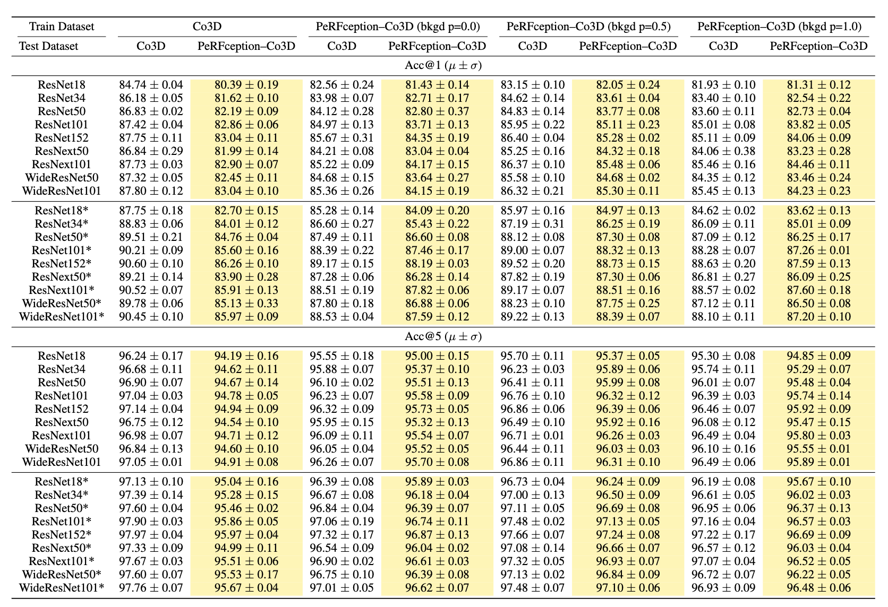
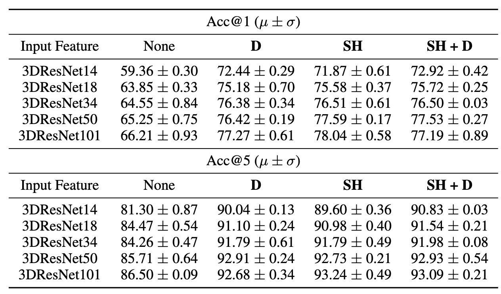

# PeRFception - Perception using Radiance Fields

<div style="text-align:center">
  
</div>

### Quick Access

[Project Page](https://postech-cvlab.github.io/PeRFception) | [Paper](https://arxiv.org/abs/2208.11537) | [Supplementary Materials](https://openreview.net/attachment?id=MzaPEKHv-0J&name=supplementary_material)
### Author Info

- [Yoonwoo Jeong](https://yoonwooinfo.notion.site) [[Google Scholar](https://scholar.google.com/citations?user=HQ1PMggAAAAJ&hl=en)]
- [Seungjoo Shin](https://seungjooshin.github.io/) [[Google Scholar](https://scholar.google.com/citations?user=io7PSDIAAAAJ&hl=en)]
- [Junha Lee](https://junha-l.github.io/) [[Google Scholar](https://scholar.google.com/citations?user=RB7qMm4AAAAJ&hl=en)]
- [Chris Choy](https://chrischoy.org) [[Google Scholar](https://scholar.google.com/citations?user=2u8G5ksAAAAJ&hl=en&oi=ao)]
- [Animashree Anandkumar](http://tensorlab.cms.caltech.edu/users/anima/) [[Google Scholar](https://scholar.google.com/citations?user=bEcLezcAAAAJ&hl=en&oi=ao)]
- [Minsu Cho](http://cvlab.postech.ac.kr/~mcho/) [[Google Scholar](https://scholar.google.com/citations?user=5TyoF5QAAAAJ&hl=en&oi=ao)]
- [Jaesik Park](http://jaesik.info/) [[Google Scholar](https://scholar.google.com/citations?user=_3q6KBIAAAAJ&hl=en&oi=ao)]

### News
- 22.10.27: Added HuggingFace repo for ScanNet.
- 22.10.25: Moved PeRFception datasets from OneDrive to HuggingFace.
- 22.08.04: The first version of PeRFception has been released. 

<div style="text-align:center">

</div>

## Abstract

The recent progress in implicit 3D representation, i.e., Neural Radiance Fields (NeRFs), has made accurate and photorealistic 3D reconstruction possible in a differentiable manner. This new representation can effectively convey the information of hundreds of high-resolution images in one compact format and allows photorealistic synthesis of novel views. In this work, using the variant of NeRF called Plenoxels, we create the first large-scale implicit representation datasets  for perception tasks, called PeRFception, which consists of two parts that incorporate both object-centric and scene-centric scans for classification and segmentation. It shows a significant memory compression rate (96.4%) from the original dataset, while containing both 2D and 3D information in a unified form. We construct the  classification and segmentation models that directly take as input this implicit format and also propose a novel augmentation technique to avoid overfitting on backgrounds of images. The code and data will be publicly available. 

## Downloading PeRFception-Datastes [[CO3D-link1](https://huggingface.co/datasets/YWjimmy/PeRFception-v1-1)] [[CO3D-link2](https://huggingface.co/datasets/YWjimmy/PeRFception-v1-2)] [[CO3D-link3](https://huggingface.co/datasets/YWjimmy/PeRFception-v1-3)] [[ScanNet]( https://huggingface.co/datasets/YWjimmy/PeRFception-ScanNet)]

```
# Link1 - PeRFception-CO3D-v1
git clone https://huggingface.co/datasets/YWjimmy/PeRFception-v1-1
# Link2 - PeRFception-CO3D-v1
git clone https://huggingface.co/datasets/YWjimmy/PeRFception-v1-2
# Link3 - PeRFception-CO3D-v1
git clone https://huggingface.co/datasets/YWjimmy/PeRFception-v1-3
# Link1 - PeRFception-ScanNet
git clone https://huggingface.co/datasets/YWjimmy/PeRFception-ScanNet
```
### Downloading specific chunks
```
mkdir <repo>
cd <repo>
git init
git remote add -f origin [link] 
git config core.sparseCheckout true
echo "some/dir/" >> .git/info/sparse-checkout
echo "another/sub/tree" >> .git/info/sparse-checkout
git pull origin main

# ex) If you want to download data only from 288_30460_58530
echo "30/plenoxel_co3d_288_30460_58530" >> .git/info/sparse-checkout
```
### PeRFception-CO3D

|Dataset| # Scenes | # Frames | 3D Shape | Features | 3D-BKGD | Memory | Memoery(Rel)
|:-:|:-:|:-:|:-:|:-:|:-:|:-:|:-:|
|CO3D| 18.6K | 1.5M | pcd | C | X | 1.44TB | $$\pm0.00\%$$
|PeRFception-CO3D| 18.6K | $$\infty$$ | voxel | SH + D | O | 1.33TB | $$-6.94\%$$

### PeRFception-ScanNet 

|Dataset| # Scenes | # Frames | 3D Shape | Features | 3D-BKGD | Memory | Memoery(Rel)
|:-:|:-:|:-:|:-:|:-:|:-:|:-:|:-:|
|ScanNet| 1.5K | 2.5M | pcd | C | X | 966GB | $$\pm0.00\%$$
|PeRFception-ScanNet| 1.5K | $$\infty$$ | voxel | SH + D | O | 35GB | $$-96.4\%$$


## Get Ready (Installation)

Our code is verified on Ubuntu 20.04 with a CUDA version 11.1.  

```
conda create -n perfception -c anaconda python=3.8 -y
conda activate perfception
conda install pytorch==1.8.0 torchvision==0.9.0 torchaudio==0.8.0 cudatoolkit=11.1 -c pytorch -c conda-forge -y
pip3 install imageio tqdm requests configargparse scikit-image imageio-ffmpeg piqa wandb pytorch_lightning==1.5.5 opencv-python gin-config gdown plyfile
pip3 install .
```


## Demo 
We provide a short demo for rendering a scene on CO3D or ScanNet. After installing the requirements, you could run the demo with the codes below:
```
# CO3D demo
python3 -m run --ginc configs/co3d.gin
# ScanNet demo
python3 -m run --ginc configs/scannet.gin
```

## Rendering CO3D and ScanNet 
We deliver the full code to reproduce the performance reported in the main paper. To run the code, you should first put the dataset on a proper location. 
```
data
  |
  |--- co3d
         -- apple 
         -- banana
         ... 
  |
  |--- scannet
         -- scene000_00
         -- scene000_01
         ...
```
ScanNet-v2 can be downloaded in [here](http://www.scan-net.org/) and CO3D-v1 can be downloaded in [here](https://github.com/facebookresearch/co3d). Thanks to great functions in `wandb`, we could manage tremendous scripts. You can download the `sweep` file [here](https://1drv.ms/u/s!As9A9EbDsoWcj6toSOfdeWMaHhqF3Q?e=1INfNg). 


## Downstream Tasks

### 2D object classification (PeRFception-CO3D)

We benchmark several 2D classification models on rendered PeRFception-CO3D. For faster reproducing, we also provide the rendered images from PeRFception-CO3D on the link [link](https://1drv.ms/u/s!AgY2evoYo6FggthVfVngtHinq3czqQ?e=crnTlu). Before running the code, be sure that you had put the  downloaded dataset on `data/perfcepton_2d`. You can easily reproduce the scores using the scripts of `scripts/downstream/2d_cls/[model].sh`. Details for the training pipeline and models are elaborated in the main paper. 

The pretrained models can be reached with the links below: 
<div style="text-align:center">

</div>

For recent updates, you can refer to the leaderboard link [here]().

### 3D object classification (PeRFception-CO3D)

We also benchmark several 3D classification models on PeRFception-CO3D. We provide the full code on the link [](). You can downloa

<div style="text-align:center">

</div>


### 3D semantic segmentation (PeRFception-ScanNet)
In PeRFception-ScanNet, we have evaluated several 3D semantic segmentation models with depth-supervised labels. 

## Plans for v2

According to the official CO3D repository[[link](https://github.com/facebookresearch/co3d)], authors provided an improved version, v2, of CO3D, which would result in better rendering quality and more accurate geometries in our model. We are planning to extend this work to PeRFception-CO3D-v2 from the CO3D-v2. 

## Citation
```bib
@article{jeong2022perfception,
  title   = {PeRFception: Perception using Radiance Fields},
  author  = {Jeong, Yoonwoo and Shin, Seungjoo and Lee, Junha and Choy, Chris and Anandkumar, Anima and Cho, Minsu and Park, Jaesik}
  year    = {2022}
}
```

## Acknowledgement
We appreciate for the reviewers for their constructive comments and suggestions. 
